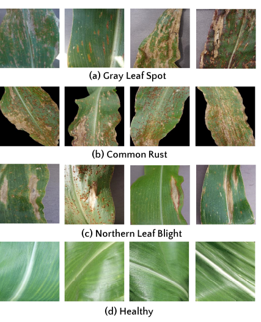

## Maize Disease Recongnition 

The Project is a CNN which tries to identify the four main Maize leaf diseases.

Summary:
1.  The data is collected using google search images where python is used.
2. The Model is built in F# using the .Net machine learning framework ML.Net.

 3. Since the data was insufficient image prepossessing methods to extend and augment the disease samples.

 4. Transfer learning is also used to accelerate the training. 

 5. The Model had an accuracy of 66% however common rust and Northern leaf blight were continually being confused. 

#### Introduction 
Maize is the third most cultivated cereal with a variety of uses:

* It is food for humans 
* It is a feed for animal husbandry.
* It is an important raw material for the light industry and medical industry.

Diseases are the primary disaster affecting maize production, and the annual
loss caused by disease is 6–10% and so quick and accurate detection is critical to improve yields.This in turn will help monitor the crop and
take timely action to treat the diseases. 

With the development of machine vision and deep learning technology, machine vision can quickly and accurately identify these maize
leaf diseases.

The disease selected for this purposes were:

### Dataset
The data set used in this exercise was obtained from google search engine using selenium. 

#### Data Augmentation
The data augmentation method is usually applied in the case of insufficient training
samples. If the sample size of the training set is too small, the training of the network model
will be insufficient, or the model will be over fitting.
The data amplification method used in
*  simple amplification - This uses the traditional image geometry transform, including image translation, rotation, cutting, and other operations.
*  experimental amplification -Image graying,Since the visual features of the disease can be retained after gray-scale processing,
the number of parameters of the model will be lessened, which can accelerate the
training and inferencing process 

### Training 
The Pretrained model parameters used are based on ImageNet dataset.

I'll kick this off with a brief brush up on ANN.The training process used in this excersise is the Back-propagation process.

The back-propagation process starts by feed forwarding all the training cases (or a batch) to the network, afterward an optimizer calculates how to update the weights of the network according to a loss function and updates them according to a learning rate. 

The training process stops when the loss converges, a certain number of epochs has elapsed or the user stops it.

### Challenges
* The appearance of maize leaves, such as shape, size,
texture, and posture, varies significantly between maize varieties and stages of growth and this complicates the image recognition model 

* During data pre-processing some difficulties were also encountered this brought
difficulties to the application of image recognition in crop disease analysis:
    1. there are often overlapping plants in the image of maize in the densely planted area;
    2. the shot will be blurry in windy conditions; 
    3. the image characteristics of maize leaf diseases vary with the degree of disease;
    4. Some of the crops in the data set had more than one disease.

### Conclusions 
The results presented here allows us to conclude
that for maize leaf disease classification, the use of CNNs is
a promising approach.A couple of things need to be put into considerations first scraping the data from the internet would not serve the purpose,its important to take picture from one geographical location.

Our Model had an accuracy of about 97% however it was still  mis-classifying some of the maize disease images. 

 